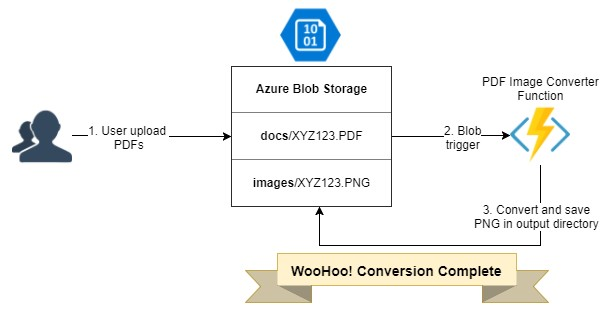

# Azure-Pdf-Imager-Function
This node.js Azure function converts Pdfs in blob storage to image files, which are then also saved to blob storage. This can be useful for Microsoft Cognitive Services like OCR that need documents in PNG format.

## Flow Diagram
Here is the typical user flow for this function.


## Usage
Deploy this function in Azure using the Continuous Deployment functionality as documented here: [Continuous deployment for Azure Functions](https://docs.microsoft.com/en-us/azure/azure-functions/functions-continuous-deployment)

## Configuration
You can configure these environment variables in the Function App (see [How to manage a function app in the Azure portal > App settings](https://docs.microsoft.com/en-us/azure/azure-functions/functions-how-to-use-azure-function-app-settings#settings) for more details).

- **StorageConnectionString**: Storager account connection string where the files are stored / uploaded.

The file **function.json** in the PdfImageConverter contains the exact configuration in which blob directories the function reacts to when PDFs are uploaded (blobTrigger > Path) and where the PNG files are stored after conversion (myOutputBlob > Path).

### PdfImageConverter/function.json

```javascript
{
  "disabled": false,
  "bindings": [
    {
      "name": "myBlob",
      "type": "blobTrigger",
      "direction": "in",
      "path": "docs/{name}", // Source blob PDF directory
      "connection": "StorageConnectionString"
    },
    {
      "name": "myOutputBlob",
      "type": "blob",
      "path": "images/{name}.png",  // Destination blob PNG directory
      "connection": "StorageConnectionString",
      "direction": "out"
    }
  ]
}
```
